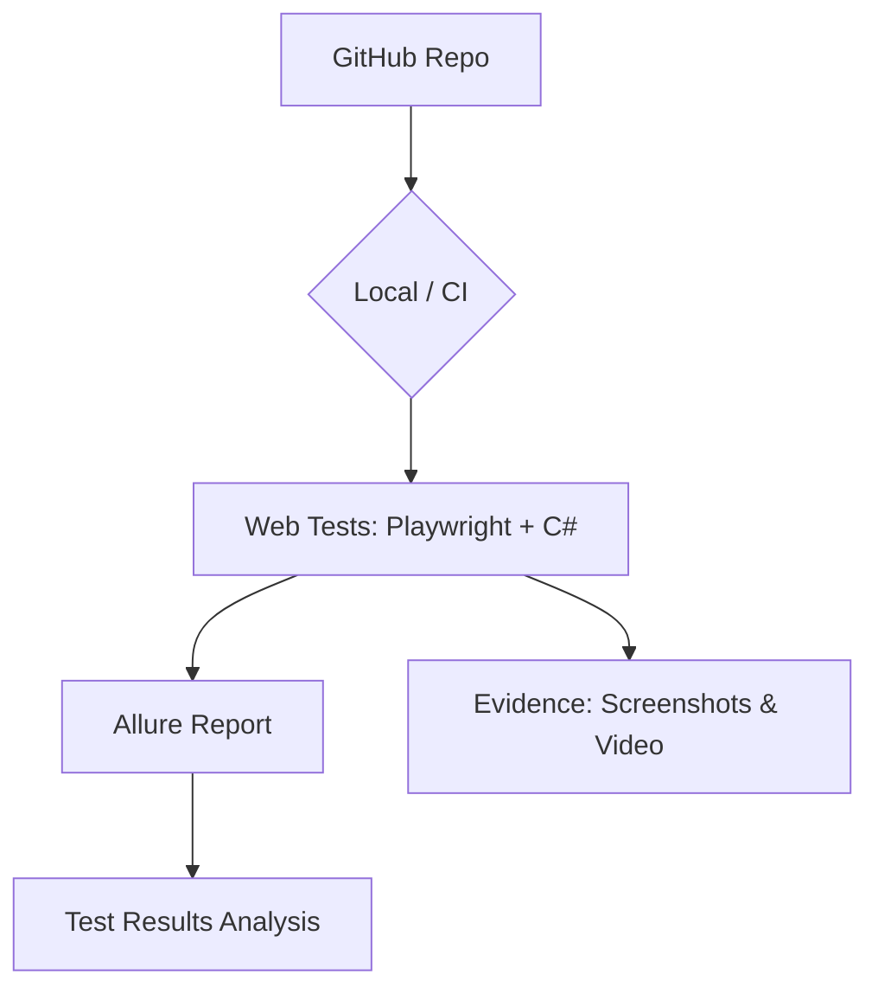

# 💳 Desafio de Automação de Testes Web — SumUp


Projeto de automação de testes web utilizando **Playwright** e **C#**, desenvolvido para cobrir os fluxos críticos da plataforma **SumUp**. O projeto utiliza o padrão Page Object Model e suporte a BDD com Reqnroll.

---

## 🏗️ Arquitetura do Projeto



---

## 📋 Índice

- [Tecnologias Utilizadas](#-tecnologias-utilizadas)
- [Pré-requisitos](#-pré-requisitos)
- [Instalação e Configuração](#-instalação-e-configuração)
- [Executando os Testes](#-executando-os-testes)
- [Estrutura do Projeto](#-estrutura-do-projeto)
- [Casos de Teste Cobertos](#-casos-de-teste-cobertos)
- [Relatórios de Teste](#-relatórios-de-teste)

---

## 🛠 Tecnologias Utilizadas

| Tecnologia | Versão | Descrição |
|---|---|---|
| **.NET SDK** | 8.0 | Ambiente de execução C# |
| **Playwright** | 1.59.0 | Framework de automação de navegadores |
| **Reqnroll** | 3.3.4 | Framework BDD (Sucessor do SpecFlow) |
| **NUnit** | 3.x | Test Runner para execução de suítes |
| **Allure Report** | 2.x | Relatórios de testes detalhados e visuais |

---

## ✅ Pré-requisitos

- [.NET 8 SDK](https://dotnet.microsoft.com/download/dotnet/8.0)
- [PowerShell](https://github.com/PowerShell/PowerShell) v7+ (recomendado)
- IDE de sua preferência (VS Code ou Visual Studio 2022)

---

## 🚀 Instalação e Configuração

1. **Clone o repositório:**
```bash
git clone https://github.com/Rafael-M-Sales/PlaywrightTests.git
cd PlaywrightTests
```

2. **Instale as dependências e faça o build:**
```bash
dotnet build
```

3. **Instale os navegadores do Playwright:**
```bash
pwsh bin/Debug/net8.0/playwright.ps1 install
```

---

## ▶️ Executando os Testes

### Executar todos os cenários (BDD + Specs)
```bash
dotnet test
```

### Executar por categoria (ex: Smoke)
```bash
dotnet test --filter "Category=smoke"
```

### Gerar e abrir relatório Allure
```bash
allure serve allure-results
```

---

## 📁 Estrutura do Projeto

```
PlaywrightTests/
├── Config/               # Configurações de ambiente (dev, homolog, prod)
├── Infrastructure/       # Docker, Jenkinsfile, K8s manifests
├── Utils/                # Helpers (Evidence, Highlight)
└── Tests/                # Núcleo de Testes
    ├── PageObjects/      # Page Object Model (Páginas)
    │   ├── BasePage.cs   # Classe base com helpers
    │   ├── HomePage.cs   # Homepage SumUp
    │   └── LoginPage.cs  # Login e autenticação
    ├── Features/         # Cenários BDD (Gherkin)
    ├── Steps/            # Implementação dos passos (Step Definitions)
    ├── Hooks/            # Hooks de ciclo de vida (Before/After)
    └── Specs/            # Testes específicos (API, Performance, Visual)
```

---

## 👨‍🏫 Foco Educativo e Didático

Este projeto segue as melhores práticas de engenharia de software para QA:
- **Page Object Model (POM)**: Separação clara entre a lógica de UI e os cenários de teste, facilitando a manutenção.
- **Evidências Step-by-Step**: Captura automática de screenshots com destaque visual (highlight) em cada interação.
- **Clean Code & Namespaces**: Estrutura organizada e nomes semânticos para fácil compreensão do time.

---

## 🧾 Casos de Teste Cobertos

### 🌐 Automação Web (`SumUp`)

| # | Cenário | Funcionalidade | Descrição | Status Esperado |
|---|---|---|---|---|
| 1 | Carregamento Homepage | Navegação | Valida se os elementos base da Home carregam | Sucesso |
| 2 | Login com Erro | Autenticação | Tentativa com email inválido e senha fake | Erro |
| 3 | Identificação Captcha | Segurança | Valida se o sistema detecta bloqueios visuais | Sucesso |
| 4 | Fluxo MFA | Segurança | Valida detecção de autenticação multifator | Sucesso |
| 5 | Título da Página | Navegação | Garante que o título do site está correto | Sucesso |
| 6 | Baseline Visual | Visual | Compara interface atual com baseline de referência | Sucesso |
| 7 | Performance: Load | Performance | Garante carregamento da Home abaixo de 5s | Sucesso |
| 8 | API Health Check | API | Valida status code 401/403 em endpoints protegidos | Sucesso |

---

## 👤 Autor

**Rafael M. Sales**  
[GitHub Profile](https://github.com/Rafael-M-Sales)

---

## 📄 Licença
Este projeto está sob a licença [MIT](LICENSE).
